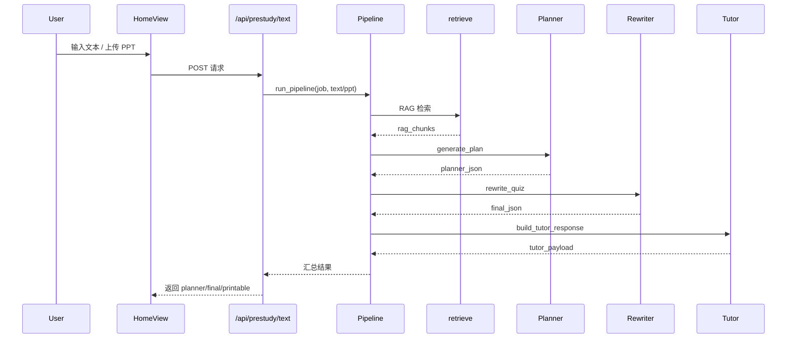

# ClassWeaver Micro-Agents 详细设计

## 1. 软件体系结构
### 1.1 架构总览
系统采用“单页应用 + REST API + 多 Agent Pipeline”的分层结构：

```mermaid
graph LR
    subgraph Frontend[Vite + Vue3]
        Home[HomeView.vue] --> APIClient
        Nav --> Home
        Nav --> QuizView
        Nav --> PrintView
    end

    APIClient -->|REST| Backend[DRF API]

    subgraph Backend[Django + Services]
        Backend --> PrestudyAPI
        Backend --> QuizAPI
        Backend --> KBAPI
        PrestudyAPI --> Pipeline
        Pipeline --> Planner
        Pipeline --> Rewriter
        Pipeline --> Tutor
        Pipeline --> RAG[Retriever]
        KBAPI --> Ingest
        Ingest --> Store
        QuizAPI --> Scoring
    end

    Store -->|向量检索| RAG
    Store --> DB[(KnowledgeDocument & Chunk)]
```

### 1.2 模块说明
- **API 层（DRF）**：位于 `src/api/views.py`，负责接收请求、调用服务、返回 JSON。
- **Pipeline 服务**：`src/services/pipeline.py` 协调文本提取、RAG 检索、Agent 调用。
- **Agents**：`src/agents/` 下定义 Planner/ Rewriter/ Tutor，统一使用 `OpenAIClient`。
- **知识库服务**：`src/kb/ingest.py` 负责切片与嵌入，`src/kb/retrieve.py` 负责检索。
- **评分服务**：`src/services/scoring.py` 处理测验评分与诊断。
- **前端视图**：`webapp/src/views/`，其中 `HomeView.vue` 集成全部教师常用功能，导航栏附带“开始测验”“打印资料”入口。

### 1.3 时序流程（预习生成）


## 2. 数据结构设计
### 2.1 ORM 模型
| 模型              | 关键字段                                                         |
|-------------------|------------------------------------------------------------------|
| `PrestudyJob`     | `source_type`, `source_excerpt`, `planner_json`, `final_json`, `status`, `duration_ms`, `model_trace` |
| `QuizSession`     | `job`, `session_id`, `questions_snapshot`, `started_at`, `ended_at` |
| `QuizAnswer`      | `session`, `question_id`, `answer`, `correct`, `kp_ids`, `used_variant` |
| `KnowledgeDocument` | `doc_id`, `title`, `source_path`, `metadata`                   |
| `KnowledgeChunk`  | `document`, `chunk_id`, `text`, `embedding`, `metadata`           |

### 2.2 Pydantic 模型
- `PlannerResponse`：保证 Planner 输出结构化。
- `PlannerQuizItem`：新增 `normalize_refs` 字段校验，兼容字符串引用。
- `TutorResponse`：包含 `summary`、`practice`、`followups`。

### 2.3 向量存储
- 默认 `FaissStore`（`IndexFlatIP`），向量持久化于 `data/faiss.index`，元数据保存至 `data/chunks.jsonl`。
- 提供 `upsert_embeddings` 以适配 ingestion。
- 若启用 `pgvector`（未来扩展），需实现同样接口。

## 3. 界面设计
### 3.1 导航结构
`webapp/src/App.vue` 提供顶部导航：
- `工作台`：默认首页。
- `开始测验`：跳转 `/take`。
- `打印资料`：跳转 `/print`。

### 3.2 主要页面
| 页面/组件             | 功能要点                                                   |
|-----------------------|------------------------------------------------------------|
| `HomeView.vue`        | 文本生成、PPT 生成、最新任务详情、知识库上传/检索         |
| `QuizTakeView.vue`    | 学生输入 session 开始答题                                  |
| `PrintView.vue`       | 渲染打印友好的预习资料                                     |
| `JsonPreview.vue`     | 以折叠方式展示调试 JSON（后续可加入开发者模式开关）        |

### 3.3 UI 状态
- 上传知识库：通过 `kbStatus` 与 `knowledgeEmptyMessage` 提示成功/失败。
- 生成状态：`isGenerating` `generationSource` 控制按钮和文案。
- 测验：`isStartingQuiz` 防止重复点击。

## 4. 算法流程
| 算法/函数                    | 说明                                                         |
|-----------------------------|--------------------------------------------------------------|
| `_chunk_text`               | 固定大小切片 + 重叠，保证上下文连贯                         |
| `OpenAIClient.embed`        | 内置最多 `max_retries` 次重试，失败抛出统一异常              |
| `retrieve_context`          | 对 Query embedding，使用 FAISS top-k 检索，返回标准字段      |
| `score_quiz`                | 计算正确率、知识点命中、出具评估摘要                        |
| `normalize_refs`（Planner） | 将字符串引用转换为 `{doc_id, chunk_id}`，忽略非法值         |

## 5. 接口设计（摘要）
| 方法 | 路径                        | 描述                                  |
|------|-----------------------------|---------------------------------------|
| POST | `/api/prestudy/text/`       | 从文本生成预习资料                    |
| POST | `/api/prestudy/ppt/`        | 从 PPTX 生成预习资料                  |
| GET  | `/api/prestudy/{job_id}/`   | 查询任务详情                          |
| POST | `/api/kb/upload/`           | 上传知识库文档                        |
| POST | `/api/kb/search/`           | 检索知识片段                          |
| POST | `/api/quiz/start/`          | 启动测验并返回 session                |
| POST | `/api/quiz/submit/`         | 提交答题并返回评分/诊断               |

## 6. 日志与监控
- `logging` 记录 ingest、RAG、Agent 调用失败等信息。
- `model_trace` 保存模型调用延迟与 rag 状态，可用于前端调试。
- 计划扩展：将 `model_trace` 写入 `LlmCallLog`，便于审计与分析。

## 7. 测试与质量
- pytest 覆盖：序列化、评分、Planner refs、JSON 解析。
- `pytest.ini` / `tests/conftest.py` 保证 `src` 可被导入。
- 建议在 CI 中运行 `python -m pytest`；前端可补充 Vitest。

## 8. 扩展方向
- 后台 UI 增加“知识库管理”“开发者模式”切换。
- 支持异步队列（Celery）处理重任务或批量生成。
- 引入模型健康监控/重试策略可配置化。
- 提供课程模板与多语言支持。

---
