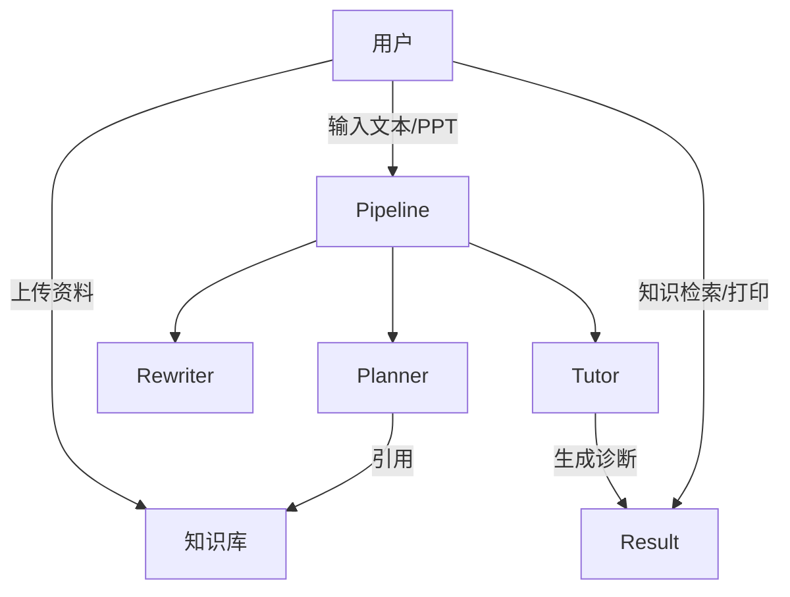

# ClassWeaver Micro-Agents 需求分析

## 1. 项目概述
ClassWeaver Micro-Agents 是一款“一站式”课前备课与测验生成工具。用户打开 Web 工作台即可上传资料、生成预习内容、发起测验，并查看自动化的辅导反馈。系统通过 Planner/ Rewriter/ Tutor 多代理协同，并结合知识库检索（RAG）提升输出质量。

## 2. 目标与范围
- **核心目标**
  - 让教师/教研人员快速生成结构化预习内容（知识点、术语、测验、打印稿）。
  - 允许上传教材或讲义构建私有知识库，从而让结果更可靠。
  - 提供测验答题、评分和诊断，便于课堂前评估。
- **范围**
  - 后端：Django REST + Pipeline Orchestrator + RAG 服务。
  - 前端：单一 Vue3 界面，内含生成、测验、打印、知识库几个入口。
  - 数据：SQLite/PostgreSQL（可切换），向量库默认为 FAISS。
  - 不包含：多租户账号体系、线上支付、第三方 LMS 集成。

## 3. 用户与使用场景
> 系统只有一个网页版工作台，教师或教研人员打开即可使用；学生在需要答题时也直接访问相同页面中的“开始测验”入口，无须区分“两个端”。

| 角色/场景           | 主要目标                                               | 关键诉求                                               |
|--------------------|--------------------------------------------------------|--------------------------------------------------------|
| 教师 / 教研人员    | 导入教材 → 生成预习内容 → 检查知识点 → 输出打印稿     | 操作简单、结果可信、可见知识来源、可导出              |
| 学生测验（扩展能力） | 使用教师分享的测验链接答题并收到诊断                 | 入口统一、流程明晰、即时反馈、鼓励话术                |

## 4. 功能需求
### 4.1 核心流程
1. **上传资料（可选）**：支持 `.txt/.pdf/.docx/.pptx`，自动切片和向量化。
2. **生成预习内容**：从文本或 PPTX 启动，输出知识点、术语表、测验、打印包。
3. **知识检索**：在前端直接输入关键词核对片段。
4. **测验管理**：发起测验、查看题目、分享 session 给学生、接收评分。
5. **打印导出**：预览打印页并通过浏览器输出 PDF。

### 4.2 系统能力
| 模块       | 描述                                                         |
|------------|--------------------------------------------------------------|
| Pipeline   | 协调 Planner（初稿）、Rewriter（优化）、Tutor（辅导）       |
| RAG        | 检索知识库片段，注入到 Prompt 中，增强回答准确性             |
| Scoring    | 根据学生作答统计正确率和知识点掌握度                         |
| Trace      | 记录每一个模型调用、耗时和 RAG 命中状态                     |

## 5. 非功能需求
- **性能**：单次生成控制在 30s 内；知识检索 < 1s（取决于向量库大小）。
- **稳定性**：遇到嵌入或生成失败需返回可理解的错误；日志记录详尽。
- **安全性**：API Key 仅保存在 `.env`；知识库文件不会上传到公共云。
- **易用性**：界面引导清晰、错误提示友好、默认即可使用。
- **可维护性**：模块化结构，pytest 提供基础回归保障。

## 6. 约束与假设
- 默认使用 SiliconFlow API，需保证网络连通。
- 上传文件需要可提取文本，纯图片需用户自行 OCR。
- FAISS 存储在本地 `data/`，若切换 pgvector 需自备 PostgreSQL。

## 7. 关键用例

### UC-1 生成预习资料
1. 用户粘贴课程文本或上传 PPT。
2. 系统执行 pipeline 并返回完整包。
3. 用户查看知识点、术语、测验、打印页。

### UC-2 导入知识库
1. 用户上传教材/讲义。
2. 系统切片、嵌入、写入索引。
3. 用户在现有界面检索验证。

### UC-3 启动测验
1. 用户点击“启动测验”。
2. 获得 session_id 与题目列表。
3. 分享 session_id；学生在同站点 `/take` 作答。

## 8. 风险与对策
| 风险                         | 对策                                                         |
|------------------------------|--------------------------------------------------------------|
| 模型返回格式不符合要求       | 使用 Pydantic 严格校验并在 Planner 添加字段自修正           |
| 嵌入请求限流或失败           | 内置重试机制；提示用户检查 Key；必要时降低并发             |
| 知识库文件过大               | 通过分块策略减小单次请求量；向用户提示拆分文件              |
| 用户看不懂调试数据           | 默认展示，但计划新增“开发者模式”开关                      |

---
